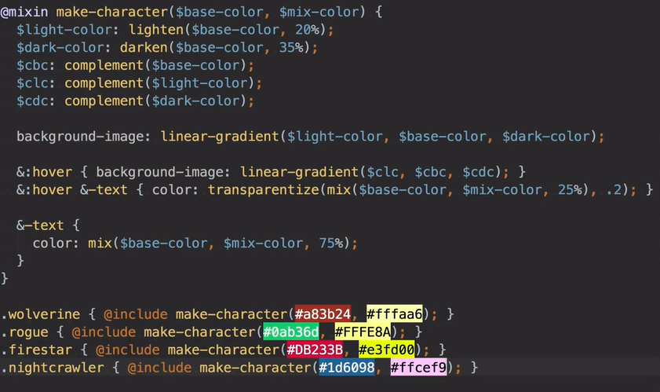
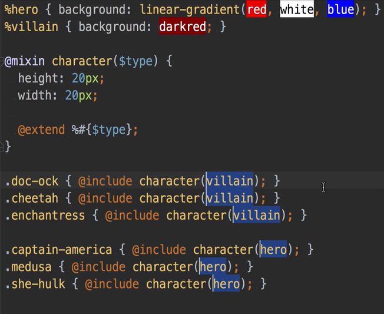
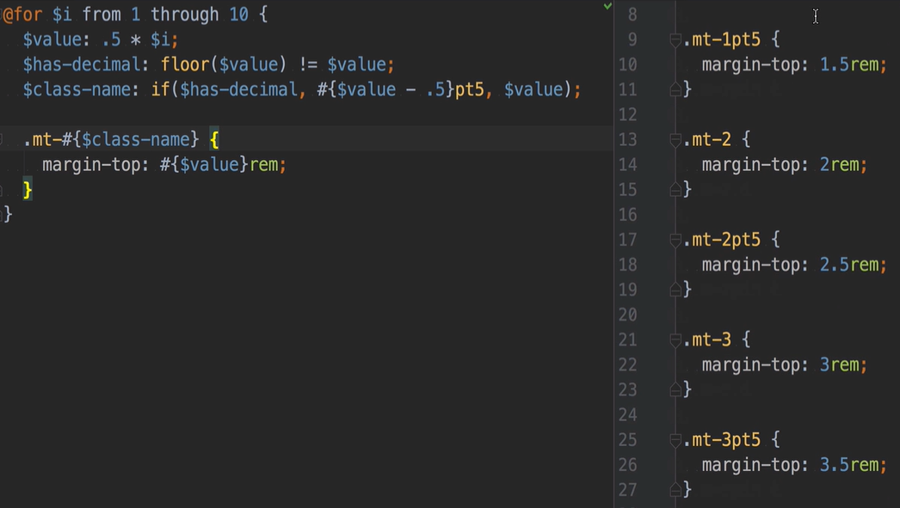
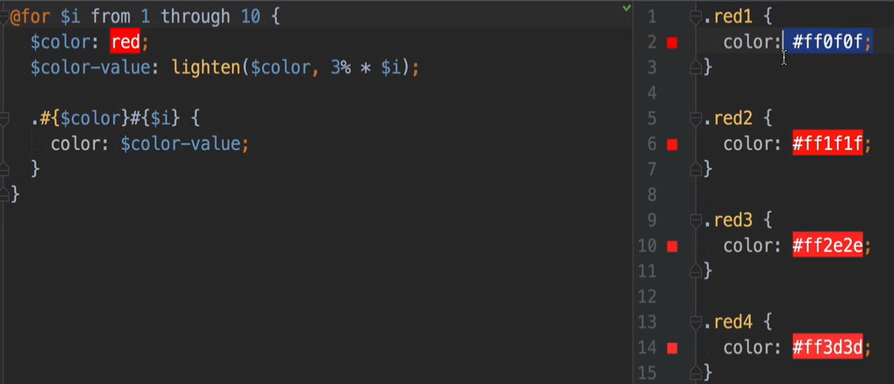
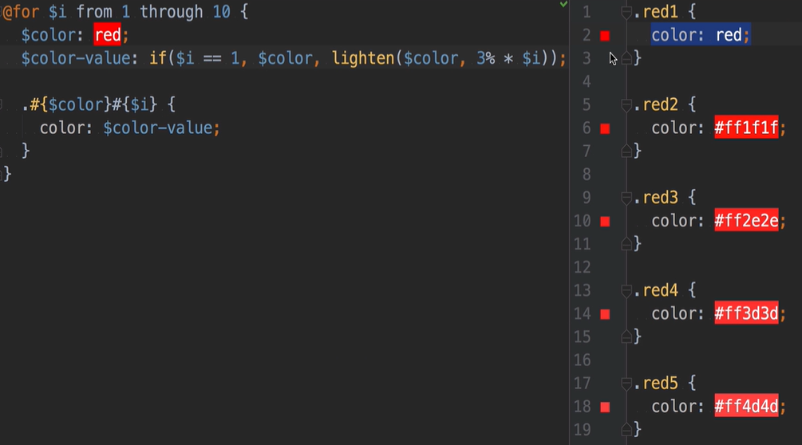
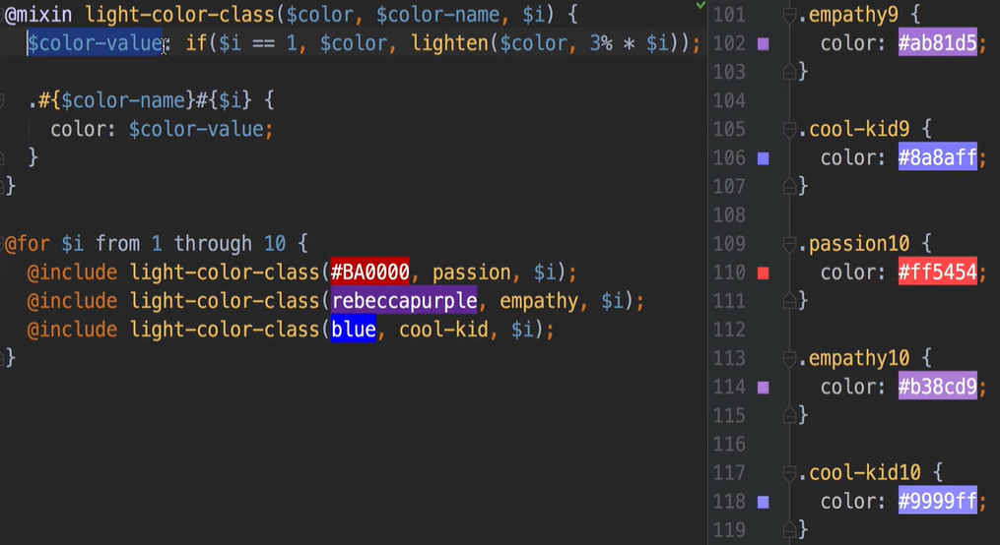
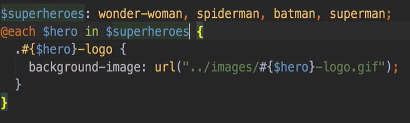
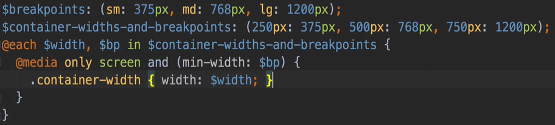
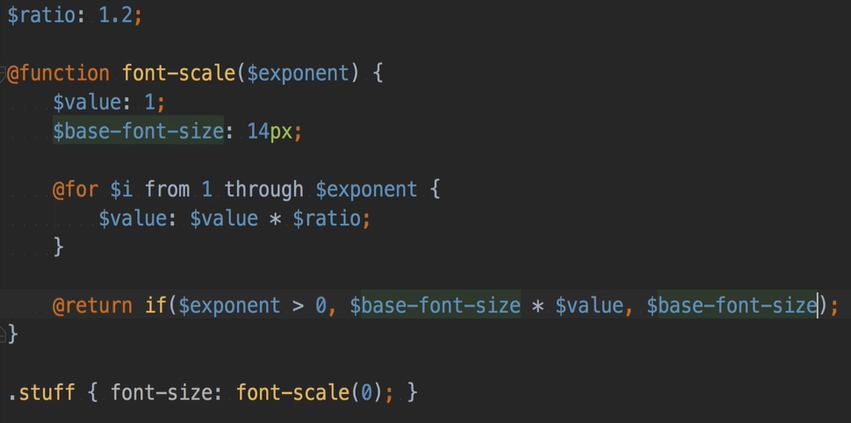

# SASS

## Instructions

1. install node-sass as dev dependency
2. create folders: scss and css
3. create script start on package.json `"start": "node-sass -o css scss"` 
4. create scss files
5. for generate css, just type `npm start`


## Performance

- when using partials in scss (_partial), only 1 request for the import scss files, because all the styles, including imports, get compile to css
- but a css import doesn't get compiled 

## SASS Imports and Modules

- order matters (not overriding styles or using styles from different files)
- use underscore (_partial)
- sass imports get compiled in one file (better performance, just one request)
- use of @import is discouraged because all become globally accessible, which is a problem with complex file structure and use libraries
- solution `@use`
- files imported with `@use` are modules
- to use mixins or variables of the modules, call them using namespaces (it's the filename)

Example of @use:

```css
@use 'src/colors';
body {
  color: colors.$accent-color;
}
.dark-region {
  @include colors.dark-background;
}
```

## Nesting & Parent Selector

- parent selector: `&`
- example: `&-container` creates a class named `x-container` to the parent `x` and `&:hover` selects the hover of the parent `x`
- avoid nesting too deep -> convention is 3 or 4 levels

```css
.some-class {
  &:hover {
    /* when hovered */
  }
  &:focus {
    /* when focused */
  }
  & > button {
    /* selector equals to .some-class > button */
  }
  &-cool {
    /*** Notice this! ****/
    // selects .some-class-cool elements
  }
}
```

## Variables

- starts with `$`
- globals (top level) and locals (block scope)
- brand-related: colors, fonts, etc
- use in every file, but be sure to import the file with variables before of all the files that are going to be using them

### SCSS variables vs. CSS variables

- CSS variables are more powerful
- they cascade
- you ca access via JS
- SCSS variables are replaced with values when compiled

## Built-in functions

- color functions
- example: `color: mix($base-color, yellow, 40%)` (the % means how much the base-color; the default is 25%)
- transparentize function decreases opacity
- lighten and darken change the color based on the light
- scale_color modifies rgb channels, alpha channel and color saturation
- the results can be passed to other functions

## @mixin directive 

- reuse a chunk of code
- first create the mixin `@mixin make-character` and them all the scss code goes inside its block `{ }`
- them to reuse you have to `@include` the mixin by its name `@include  make-character`
- for example `.batman { @include  make-character }` means that the class `batman` is reusing the code of the ` make-character`
- looks like a function: you can pass argument, for example, `$base-color` and pass it again when including this mixin in other classes 
- can have default arguments and optional one as well
- if you don't know how many arguments, can have variable arguments
- mixins it's like a blueprint
- content directive `@content` allows to add styles to the mixin, and determine where specific to you want to add -> very useful for media-queries
- don't change the source order

Example on @mixin with argument:

```css
@mixin square($size) {
  width:$size;
  height:$size;
}
div {
  @include square(60px);
  background-color:#000;
}
```
Example on @mixin with @content:

```css
@mixin hover-not-disabled {
  &:not([disabled]):hover {
    @content;
  }
}
.button {
  border: 1px solid black;
  @include hover-not-disabled {
    border-color: blue;
  }
}
```



## @extend directive 

- just like extend a class in a OOP language
- inherit styles and pseudo-elements / pseudo-class from base class 
- in compiled css, they're glued together
- maintain relationships between classes
- impact: hard to ready and make debug difficult
- placeholder selector `%`
- extends don't have arguments and can't pass `@content` 
- change the source order



## @for directive

- loop
- `$i` iteration value
- has start and end points 
- `to` is not inclusive
- `through` is inclusive
- example `@for $i from 1 to 10`
- great for creating quick column classes or margin classes or color classes
- can be combined with @mixins









## @if @else flow control

Example of @if @else inside a @mixin:

```css
@mixin theme($is-dark: false) {
  @if $is-dark {
    // styles for dark
  }
  @else {
    // styles for light
  }
}
```

## @each directive

- iteration loop
- `$hero` iteration variable
- use `in`
- iterate over a sass list (like an array, but the first index is 1)
- iterate over maps (key, value)





Example of a @each flow control (similar to foreach() from JS):

```css
$sizes: 40px, 50px, 80px;
@each $size in $sizes {
  .icon-#{$size} {
    font-size: $size;
    height: $size;
    width: $size;
  }
}
```
Here, the `#{$size}` notation is used to make dynamic names -> interpolation

## @function directive

`@function background($color) {
    @return $color;
}`

- has name, accepts arguments and returns something
- needs a return
- can have default and optional arguments
- why use function if we can get same results with mixins?
- mixins return reusable block of styles
- functions return reusable values
- depend on the use case
- for example, calculate typographic scale is better with function



# Sources

[Learn the Best and Most Useful SCSS](https://egghead.io/courses/learn-the-best-and-most-useful-scss)

[The definitive guide to SCSS](https://blog.logrocket.com/the-definitive-guide-to-scss/)

